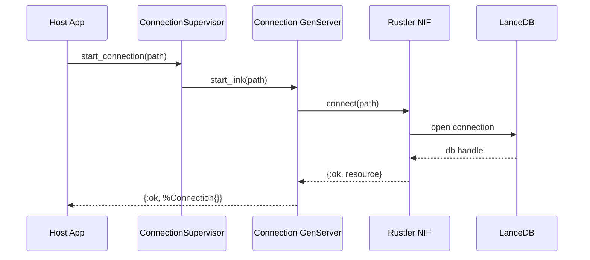
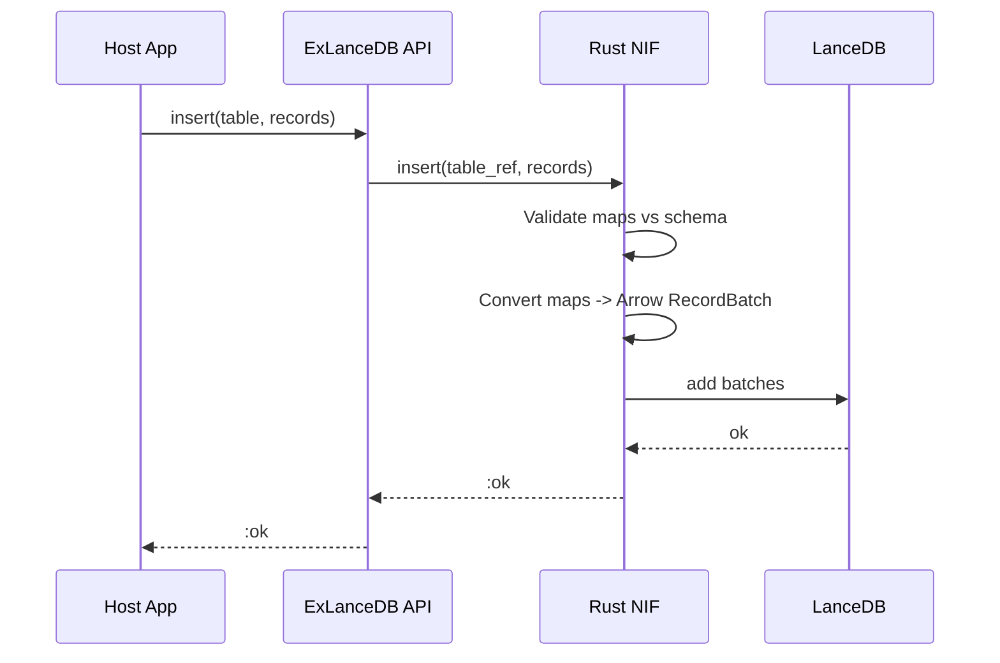
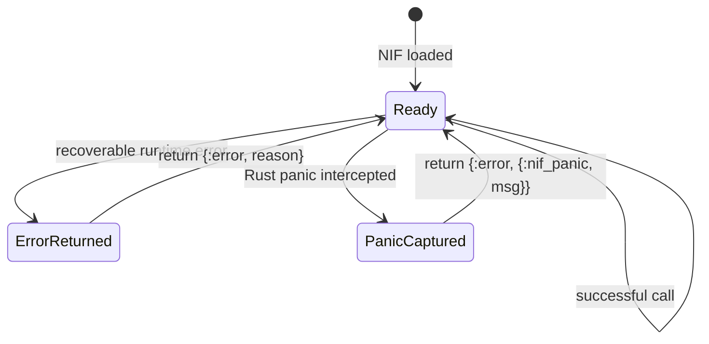

<!-- status: locked -->
# Core Flows: ex_lancedb v0.1

## Flow 1: Connect and Supervised Connection Ownership
**Actors**: Host Elixir App, `ExLanceDB.ConnectionSupervisor`, `ExLanceDB.Connection`, Rust NIF, LanceDB
**Trigger**: Host calls `ExLanceDB.connect(path)`
**Preconditions**: Filesystem path is accessible
**Postconditions**: Connection process exists and wraps a valid Rust resource
**Invariants**:
- Public return shape is `{:ok, conn} | {:error, reason}`
- Blocking work executes only on dirty schedulers

**Error states**:
- Path invalid/unwritable -> `{:error, :invalid_path | :io_error}`
- NIF load failure -> `{:error, :nif_not_loaded}`
- Rust panic -> converted to `{:error, {:nif_panic, message}}`

## Flow 2: Schema Declaration and Table Lifecycle
**Actors**: Host App, Schema macro, Connection process, NIF, LanceDB
**Trigger**: Host defines schema module then calls `create_table/3` or `open_table/2`

**Steps**:
1. Developer defines fields using `use ExLanceDB.Schema`.
2. `create_table/3` extracts schema metadata.
3. Connection process invokes NIF with table name + schema metadata.
4. NIF maps schema to LanceDB table creation request.
5. Caller receives `%Table{}` handle.

**Success state**: Table exists/opened and can be used for insert/search/index.
**Edge cases**:
- Creating an existing table may return explicit error or open existing table based on chosen policy.
- Invalid schema definitions fail in Elixir before crossing NIF boundary.

## Flow 3: Batch Insert
**Actors**: Host App, Table handle, NIF, LanceDB
**Trigger**: `ExLanceDB.insert(table, records)`

**Error states**:
- Missing/invalid field type -> `{:error, {:invalid_record, details}}`
- Vector dimension mismatch -> `{:error, {:invalid_vector_dim, expected, got}}`
- Storage failure -> `{:error, {:storage_error, details}}`

## Flow 4: Similarity Search with Optional Filter
**Actors**: Host App, API layer, NIF, LanceDB
**Trigger**: `ExLanceDB.search(table, embedding, opts)`

**Steps**:
1. API validates `embedding` type and options.
2. NIF invokes vector search with top-k limit.
3. Optional filter string is applied if present.
4. Search results are converted to Elixir tuples `{score, map}`.

**Success state**: `{:ok, [{score, record}]}` ordered by relevance score semantics from LanceDB.
**Edge cases**:
- Invalid filter syntax -> normalized filter error.
- Limit <= 0 -> Elixir-side validation error.
- Empty result set -> `{:ok, []}`.

## Flow 5: Index Management
**Actors**: Host App, API layer, NIF, LanceDB
**Trigger**: `ExLanceDB.create_index(table, :embedding, :ivf_pq)`

**Steps**:
1. API validates supported index types.
2. NIF dispatches index creation request.
3. LanceDB builds index metadata on-disk.
4. API returns `:ok`.

**Error states**:
- Unsupported index kind -> `{:error, {:unsupported_index, type}}`
- Missing vector column -> `{:error, {:invalid_index_column, field}}`

## Flow 6: Fault Containment and Error Normalization
**Actors**: API layer, NIF boundary

**Key constraint**: No raw panic propagates to caller process; all failures become explicit Elixir error tuples.
