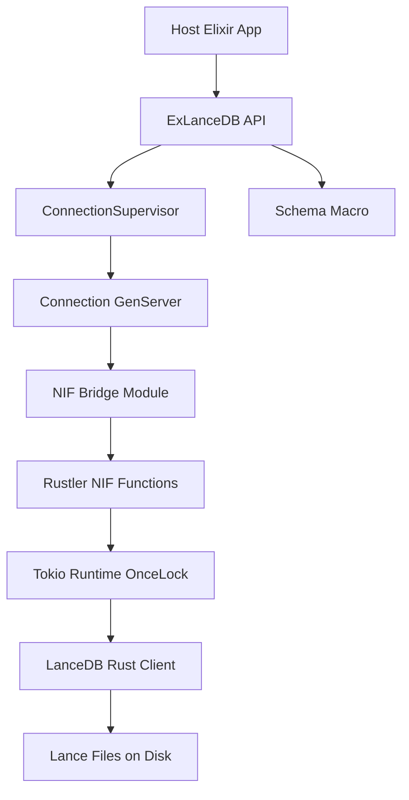

<!-- status: locked -->
# Tech Plan: ex_lancedb v0.1

## Architecture Overview
`ex_lancedb` will be a layered Elixir+Rust library:
- Public Elixir API module (`ExLanceDB`) exposes stable ergonomic functions.
- OTP connection supervision and GenServer-based ownership for connection resources.
- NIF bridge module (`ExLanceDB.Nif`) is the only direct Rustler call site.
- Rust crate (`native/ex_lancedb_nif`) wraps LanceDB client and Arrow conversions.



## Design Decisions

| Decision | Choice | Rationale | Trade-off |
|----------|--------|-----------|-----------|
| Module naming | Move to `ExLanceDB` canonical module | Matches target public API and ecosystem naming expectations | Breaks scaffold name; requires migration in tests/docs |
| Rustler package | `{:rustler, "~> 0.37.3", runtime: false}` | Matches provided docs and current stable API | Requires local Rust toolchain for v0.1 |
| NIF scheduling | `schedule = "DirtyIo"` for all blocking calls | Protects normal schedulers from blocking IO | Dirty pool saturation risk under heavy parallel workload |
| Runtime ownership | Global Tokio runtime (`OnceLock<Runtime>`) | Avoid runtime-per-call overhead and simplify async bridging | Global runtime lifetime management complexity |
| Resource handling | `ResourceArc<Mutex<...>>` for DB/Table state | Safe sharing across BEAM processes | Mutex contention under high concurrency |
| Error surface | Enum-based Rust errors mapped to Elixir atoms/tuples | Predictable API and better tests | Requires explicit mapping upkeep |

## Non-Negotiables / Invariants
- No public API function raises on operational errors.
- No blocking work on non-dirty schedulers.
- No Arrow or internal Rust types exposed to Elixir callers.
- Rust panic paths are captured and normalized.
- Table handles are tied to connection lifecycle and validated on each call.

## Data Model

### Elixir Structs

```elixir
%ExLanceDB.Connection{
  pid: pid(),
  ref: reference(),
  path: String.t()
}

%ExLanceDB.Table{
  connection: ExLanceDB.Connection.t(),
  name: String.t(),
  ref: reference(),
  schema: ExLanceDB.Schema.Metadata.t() | nil
}

%ExLanceDB.Schema.Field{
  name: atom(),
  type: :string | :integer | :float | :boolean | :vector,
  opts: keyword()
}
```

### Rust Internal Types

```rust
struct DbResource {
    db: lancedb::Connection,
    path: String,
}

struct TableResource {
    table: lancedb::Table,
    name: String,
    schema: SchemaDef,
}

struct SchemaDef {
    fields: Vec<FieldDef>,
    primary_field: Option<String>,
}

struct FieldDef {
    name: String,
    kind: FieldKind,
    vector_dim: Option<usize>,
}

enum FieldKind { String, Int64, Float64, Bool, Vector }
```

## Component Architecture

### `ExLanceDB` (Public API)
Responsibilities:
- Validate options/types before NIF boundary.
- Delegate connection-owned operations through connection process.
- Normalize and document return contracts.

### `ExLanceDB.ConnectionSupervisor` + `ExLanceDB.Connection`
Responsibilities:
- Own DB resources with OTP semantics.
- Serialize operations per connection process (initial version).
- Manage cleanup on process termination.

### `ExLanceDB.Schema`
Responsibilities:
- Compile-time DSL for field declarations.
- Produce schema metadata via generated `__schema__/1` callbacks.
- Validate vector dimensions and supported field types.

### `ExLanceDB.Nif`
Responsibilities:
- `use Rustler` module and NIF stubs.
- Panic-safe wrappers around raw NIF calls.
- Narrow term conversions (Elixir map/list -> NIF args).

### Rust crate `ex_lancedb_nif`
Responsibilities:
- LanceDB connection/table operations.
- Arrow schema and record batch conversion for inserts/results.
- Search/index operations and error mapping.

## Interfaces and Compatibility
- Public API introduced in v0.1 is new; no backward compatibility constraints yet.
- Error tuple taxonomy documented and tested.
- `ExLancedb` legacy module remains as compatibility alias (deprecation warning optional).

## Performance and Resource Budgets
- Connection open p95: under 300 ms on local SSD.
- Top-10 search (100k vectors, dim 768) p95: under 120 ms after index creation.
- Insert throughput target: at least 10k vectors/second in batch mode on local development hardware.
- Memory: avoid per-call runtime initialization and avoid copying vectors more than necessary.

## Observability and Diagnostics
- Elixir-side optional debug logging via `Logger.debug/2` around operation boundaries.
- Rust-side structured error strings with operation tags (`connect`, `create_table`, `insert`, `search`, `create_index`).
- Test helpers capture and assert normalized reason tuples.

## File Changes

### New Files
- `config/config.exs`
- `lib/ex_lance_db/application.ex`
- `lib/ex_lance_db/connection_supervisor.ex`
- `lib/ex_lance_db/connection.ex`
- `lib/ex_lance_db/table.ex`
- `lib/ex_lance_db/schema.ex`
- `lib/ex_lance_db/error.ex`
- `lib/ex_lance_db/nif.ex`
- `native/ex_lancedb_nif/Cargo.toml`
- `native/ex_lancedb_nif/src/lib.rs`
- `native/ex_lancedb_nif/src/error.rs`
- `native/ex_lancedb_nif/src/runtime.rs`
- `native/ex_lancedb_nif/src/convert.rs`
- `test/support/fixture_data.ex`
- `test/ex_lance_db_integration_test.exs`

### Modified Files
- `mix.exs`
- `lib/ex_lancedb.ex`
- `README.md`
- `test/ex_lancedb_test.exs`

## Milestone Sequencing

| # | Milestone | Gate |
|---|-----------|------|
| 1 | Elixir scaffolding and supervision | Project compiles, unit tests pass |
| 2 | Rustler NIF skeleton + runtime init | NIF loads and `connect/1` smoke test passes |
| 3 | Schema + table lifecycle | `create_table/3` and `open_table/2` integration tests pass |
| 4 | Insert pipeline | Batch insert integration test passes with fixture data |
| 5 | Search + filter + scoring output | Search test passes with expected tuple shape and filter behavior |
| 6 | Index creation + docs polish | Index test and README quickstart validated |

## Testing Strategy
- Layer 1 Unit tests (Elixir): schema macro behavior, API validation, error normalization.
- Layer 2 Integration tests (Elixir + NIF + LanceDB): connect/table/insert/search/index using temporary directories.
- Layer 3 Safety tests: invalid inputs and panic-safe behavior where feasible.

## Risks and Mitigations

| Risk | Likelihood | Impact | Mitigation |
|------|------------|--------|------------|
| LanceDB crate API mismatch with assumptions | Medium | High | Pin versions early, compile frequently, adjust wrappers with minimal surface |
| Arrow conversion complexity for mixed map fields | Medium | High | Restrict v0.1 field types, validate strictly, add focused conversion tests |
| NIF error leakage/panic propagation | Low | Critical | Wrap unsafe boundaries with `catch_unwind` and exhaustive error mapping |
| Naming migration from scaffold `ExLancedb` | High | Medium | Keep compatibility wrapper and update tests/docs together |

## Open Questions
- Exact index parameter defaults for IVF-PQ in selected LanceDB version.
- Whether filter expression syntax differs across LanceDB versions.
