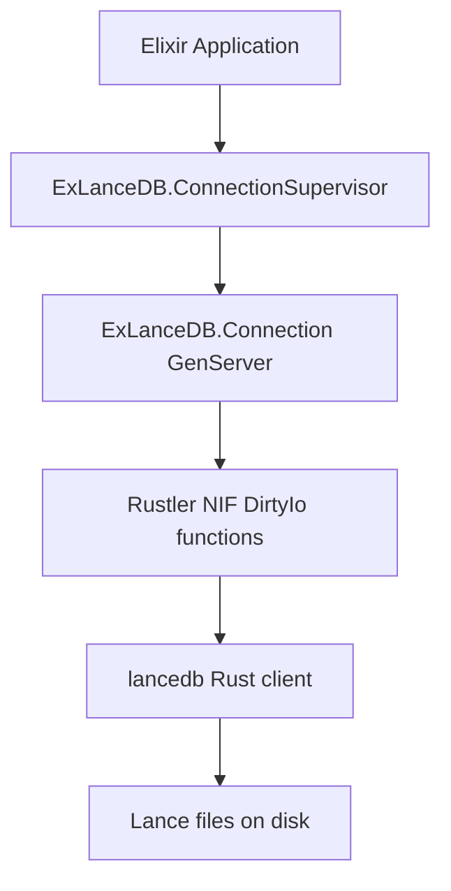

# Reference: Architecture

`ex_lancedb` uses a thin Elixir API layer with Rust native execution through Rustler.

## Runtime Notes

- Connection and table handles are Rustler resources.
- Blocking LanceDB calls run on dirty schedulers.
- Tokio runtime is initialized once in the NIF layer.
- Arrow conversion is encapsulated in Rust, not exposed to Elixir callers.
